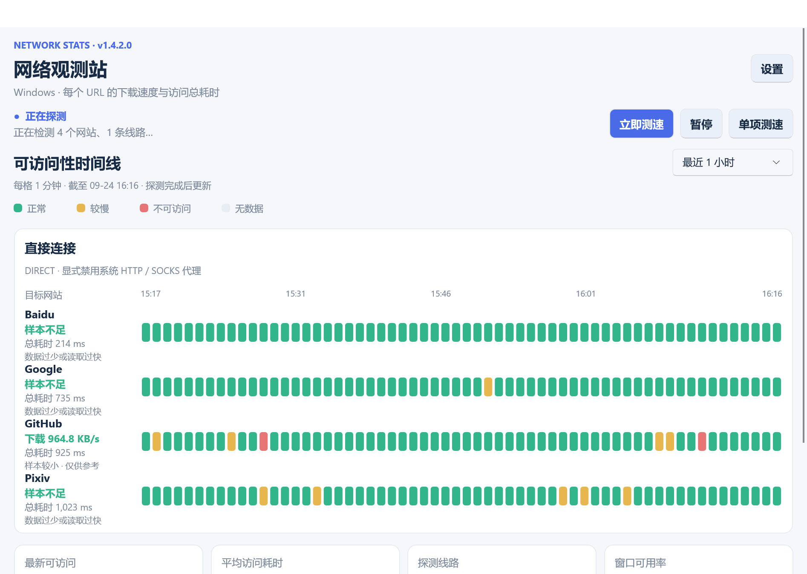

# Network Stats · 网络观测站

[English](README.md) | 简体中文

用时间线查看网站是否可访问、访问耗时和响应体下载速度，持续观察直连与代理线路的网络表现。

**尤其适合“科学上网”用户**：同时监测常用网站，比较直连和 HTTP、HTTPS、SOCKS5 代理的连通性与稳定性，快速发现线路异常；代理使用你已有的服务。

## 使用引导

1. 在 [GitHub Releases](https://github.com/SHW2002/Network-Stats/releases/latest) 下载对应平台包：Windows x64 使用 **Network-Stats.exe**，Android arm64 使用 APK，macOS 按 Apple Silicon / Intel 选择 ZIP；iOS 当前提供 Xcode Simulator 包。
2. 打开 **设置**，添加要监测的网站和代理地址，保存后自动开始探测；直连始终保留，本机代理通常填写 `127.0.0.1` 和代理软件提供的端口。
3. 查看时间线：绿色表示正常、黄色表示较慢、红色表示不可访问，空格表示没有数据；可切换最近 1、3、6、24 小时，点击色块查看详情。
4. 使用 **立即测速** 刷新整组结果，或进入 **单项测速** 复测一个网站；在 **设置 → 软件更新** 中检查并安装新版本，也可单独配置更新代理。

Windows 最小化后会在托盘继续监测，双击托盘图标恢复，右键可退出；设置中可调整深浅色主题、开机自启动及关闭窗口时的行为。

测速反映目标 URL 的响应体传输情况，不能直接当作宽带峰值；样本不足时会明确提示，配置和历史记录保存在本机。

## 开发框架

- **.NET 10 + .NET MAUI**：原生界面，支持 Windows、Android、iOS 和 macOS（Mac Catalyst）工程。
- **GraphicsView**：绘制每分钟网络状态时间图；Windows 界面基于 WinUI 3。
- **NetworkStats.Core**：HTTP 探测、代理、调度、历史存储与更新逻辑；**NetworkStats.App**：界面及平台集成。
- 当前 Release 提供 Windows x64、Android arm64、macOS arm64 / x64 及 iOS 模拟器 arm64 / x64；iOS 真机包需要 Apple 开发者签名，macOS 包采用 ad-hoc 签名且未公证。

安装 .NET 10 SDK 后，在 Windows 上运行：

```powershell
dotnet workload install maui-windows
.\scripts\run-windows.ps1 -Development
```

本地测试和生成 Windows 单文件包：

```powershell
.\scripts\test.ps1
.\scripts\publish-windows.ps1
```

每次执行 `dotnet publish` 都会自动将发布目录压缩到 `bin/Release-Archives/`，文件名为 `程序名-平台-包体类型-yymmdd-hhmmss.zip`。

共享图标 SVG 位于 `src/NetworkStats.App/Resources/AppIcon/`；修改后在 Windows 上运行 `./scripts/icons/update-icons.ps1`，同步生成 Windows ICO 和文档 PNG。圆角底板四周各留出 16.4% 边距，Android 和 iOS 使用浅色外围背景以适配平台图标要求。

[更新日志](CHANGELOG.md) · [MIT License](LICENSE)

<p align="center">
  
</p>
